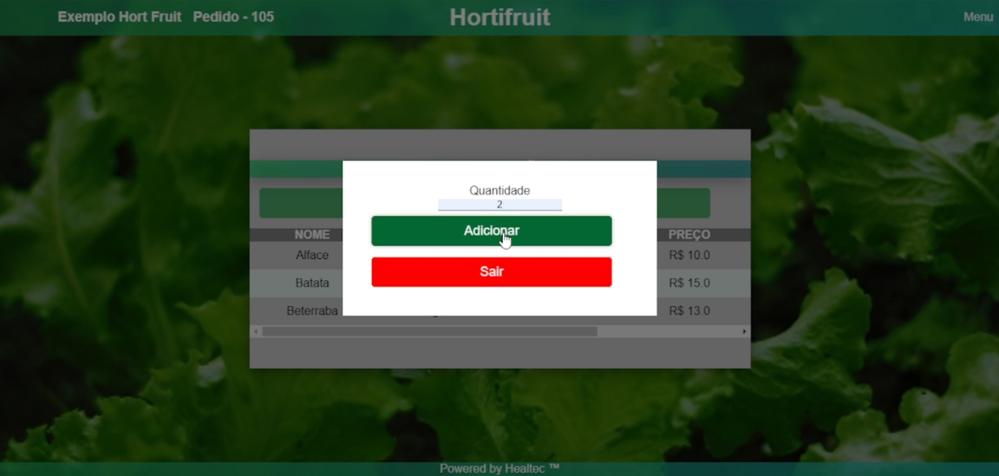

# Projeto Hortfruit
### Projeto Hortfruit da faculde UMC - Universidade de Mogi das Cruzes
#### Atividade M2 - Web (.jsp / Class) - FINAL
**Integrantes:**
>`Gustavo Moreno Siqueira Veiga - 11221102124` 
>`Marcos Antônio de Paula Júnior - 11221100107`  
>`Matheus Augusto Lopes de Macedo - 11221100925` 
>`Beatriz Nogueira Santos Brito - 11221101657` 
---
## Screenshots do projeto:
<h3 align="center"> Tela de login </h3> 

<h3 align="center"> Tela de Cadastro </h3>

<h3 align="center"> Tela de Pedido </h3>

<h3 align="center"> Tela de Pedido (ID Gerado) </h3>

<h3 align="center"> Menu (Perfil Usuario)</h3>

<h3 align="center"> Menu (Perfil Administrador)</h3>

<h3 align="center"> Tela de Produtos (Perfil Usuario)</h3>

<h3 align="center"> Tela de Produtos - Modal Adicionar (Perfil Usuario)</h3>

<h3 align="center"> Tela de Produtos (Perfil Administrador)</h3>

<h3 align="center"> Tela de Produtos - Modal Edição (Perfil Administrador)</h3>

<h3 align="center"> Tela de Cadastro (Perfil Administrador)</h3>

<h3 align="center"> Tela Carrinho</h3>

